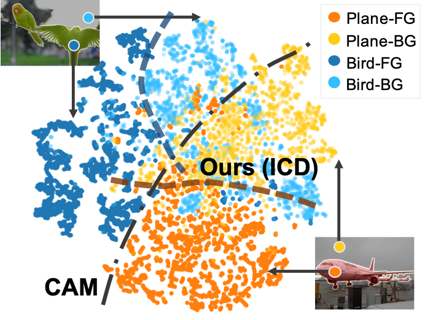
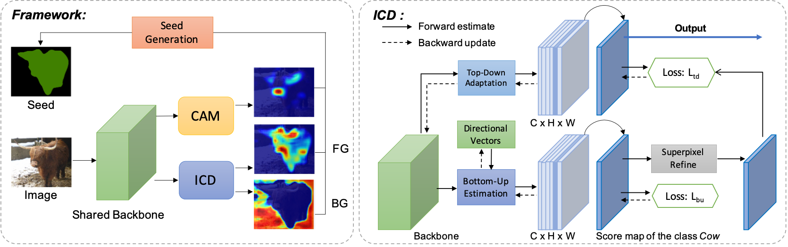
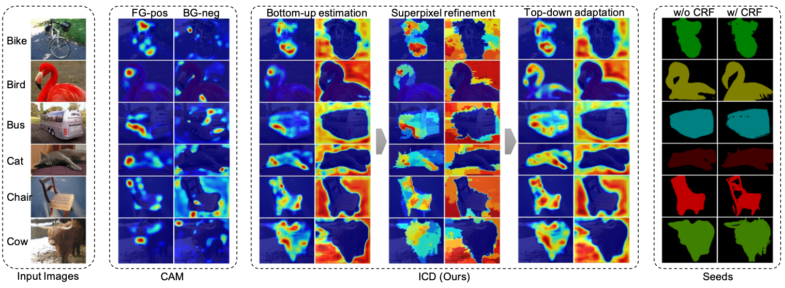

# Learning Integral Objects with Intra-Class Discriminator for Weakly-Supervised Semantic Segmentation
Learning Integral Objects with Intra-Class Discriminator for Weakly-Supervised Semantic Segmentation, Junsong Fan, Zhaoxiang Zhang, Chunfeng Song, Tieniu Tan, CVPR2020 [[paper]](http://openaccess.thecvf.com/content_CVPR_2020/papers/Fan_Learning_Integral_Objects_With_Intra-Class_Discriminator_for_Weakly-Supervised_Semantic_Segmentation_CVPR_2020_paper.pdf).


## Introduction

The previous class activation map (CAM) based approach learns inter-class boundaries, which focus on the difference between different foreground classes. It may not be optimal for the weakly supervised segmentation problem because the target object and the background share the same classes in the same image. To alleviate this problem, we propose an ICD approach to learning per-category intra-class boundaries between the foreground objects and the background, which is more appropriate for weakly supervised segmentation problems.




The proposed approach is end-to-end and can be trained together with the CAM branch in a single round. The pseudo-masks derived by the proposed ICD is more complete than the CAM based results.






## Prerequisite

- Python 3.7, MXNet 1.3.1, Numpy, OpenCV, [pydensecrf](https://github.com/lucasb-eyer/pydensecrf)
- NVIDIA GPU


## Usage

**Prepare the data and pretrained parameters:**

- Download the VOC 2012 dataset, which should contain `VOC2012/JPEGImages` and `VOC2012/Annotations`.
- Download the ImageNet pretrained parameters for the [VGG16 backbone](https://drive.google.com/file/d/1SVQgdnuhL7Wo3XIDfwhjVMTk_N1qiVHw/view?usp=sharing) and put it in the folder `ICD/data/pretrained`
- Download the pre-computed superpixels from [here](https://drive.google.com/file/d/1zU2RRBvHueK6PsOFK71cDLyhbROeAzaT/view?usp=sharing), untar it, and put it into the folder `ICD/data/superpixels`. 

**Run:**

```
python run_icd.py --gpus 0,1 --image-root Your/VOC2012/JPEGImages --annotation-root Your/VOC2012/Annotations --superpixel-root ./data/superpixels/voc_superpixels
```

The above script contains codes for training and generating the seeds. By default, the seeds will be generated at `./snapshot/icd/results/seeds/crf`. After obtaining the seeds, you can take them as pseudo labels and train any segmentation models on the training set, for example, the DeepLab-v2 used in the paper. Codes to train the Deeplab-v2 models will also be released soon.

## Citation

```
@InProceedings{Fan_2020_CVPR,
author = {Fan, Junsong and Zhang, Zhaoxiang and Song, Chunfeng and Tan, Tieniu},
title = {Learning Integral Objects With Intra-Class Discriminator for Weakly-Supervised Semantic Segmentation},
booktitle = {IEEE/CVF Conference on Computer Vision and Pattern Recognition (CVPR)},
month = {June},
year = {2020}
}
```

